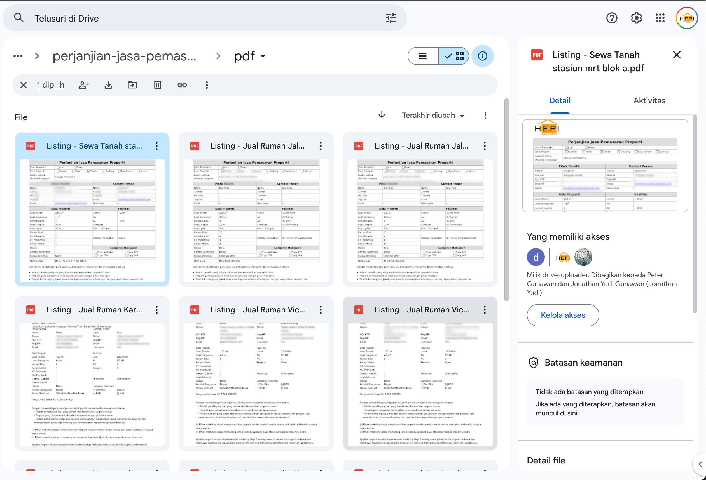

# Perjanjian Jasa Pemasaran Properti

Digital data collection system of property marketing.

## Features

1. Generate PDF file from HTML jinja template.
1. Integration to [Tally](https://tally.so/) for building free and beautiful form
1. Integration to [Google Drive](https://drive.google.com/) for storing the generated PDF
1. Integration to [Google Sheets](https://docs.google.com/) for storing the submission data

Click [here](sample-generated.pdf) for viewing the sample generated file.

### Screenshots


once submitted, server will generate PDF and store it in Google Drive.



## Prerequisites

1. Python
1. Python packages: `pip` and `venv`
1. [ngrok](https://ngrok.com/)
1. Terraform
1. Docker and docker compose
1. GCP account with active billing account
1. Tally account

## Tech Stacks

1. [FastAPI](https://fastapi.tiangolo.com/) for the http framework
1. [Pydantic](https://docs.pydantic.dev/latest/) for the data model and validation
1. [PyMuPDF](https://pymupdf.readthedocs.io/en/latest/) for generating PDF
1. [Google Cloud Platform](https://console.cloud.google.com/) for the deployment
1. [Google Drive](https://drive.google.com/) for the storage solution
1. [Docker](https://www.docker.com/) and [Docker Compose](https://docs.docker.com/compose/) for containerization and local build
1. [Google Cloud Run](https://cloud.google.com/run) for production deployment

## Development

1. Prepare gcloud project

    ```bash
    export CONFIG_PROFILE_NAME=hepi-properti
    gcloud config configurations create $CONFIG_PROFILE_NAME
    gcloud config configurations activate $CONFIG_PROFILE_NAME
    gcloud auth login
    gcloud auth application-default login
    ```

1. Prepare credentials for terraform

    ```bash
    cp terraform.tfstate.example terraform.tfstate
    ```

1. Prepare the resources in GCP (service account and Google Drive API)

    ```bash
    terraform init
    terraform plan
    terraform apply
    terraform output service_account_key
    ```

1. Copy and put the service account key in a json file, ie: `serviceaccounts/hepi-properti.json`

1. Copy the service account's email, and give permission to the PDF result's drive folder.

   * Go to https://drive.google.com/
   * Create folder, share to the service account with editor access
   * Copy the Drive Folder ID. The folder ID is the part of the URL after folders/. For example:

       ```txt
       https://drive.google.com/drive/folders/1A2B3C4D5E6F7G8H9I0J
       ```

       The folder ID is `1A2B3C4D5E6F7G8H9I0J`.


1. Setup and activate python virtual environment (`venv`)

    ```bash
    python3 -m pip venv venv
    source venv/bin/activate
    ```

1. Install requirements

    ```bash
    pip install -r requirements.txt
    ```

1. Prepare `.env` file

    ```bash
    cp .env.example .env
    ```

1. Start server

    ```bash
    python main.py
    ```

1. Expose to ngrok

    ```bash
    ngrok http 8000
    ```

1. Setup [tally](https://tally.so/), connect the webhook

## Local Deployment

1. Build the docker image

    ```bash
    make build
    ```

1. Run using `docker-compose`

    ```bash
    make run
    ```

## Deployment

1. Build the docker image

    ```bash
    make build
    ```

1. Push the image to container registry

    ```bash
    make push
    ```

1. Deploy to cloud run using terraform

    ```bash
    make deploy
    ```

1. Get the cloud run URL and put it in tally webhook and redirection url. Add `/submit` and `/pdf` suffix after the URL.

## Stopping Local Deployment

1. Stop docker container using

    ```bash
    make stop
    ```

## Appendix

1. Form: https://tally.so/r/3jzaA9
2. Document: https://docs.google.com/document/d/16TMlmsTV3LDNHDqzcNkKqC8ztLa7NaeZpEKYJSv2DRA/edit?tab=t.0#heading=h.l77i63dlykk4
